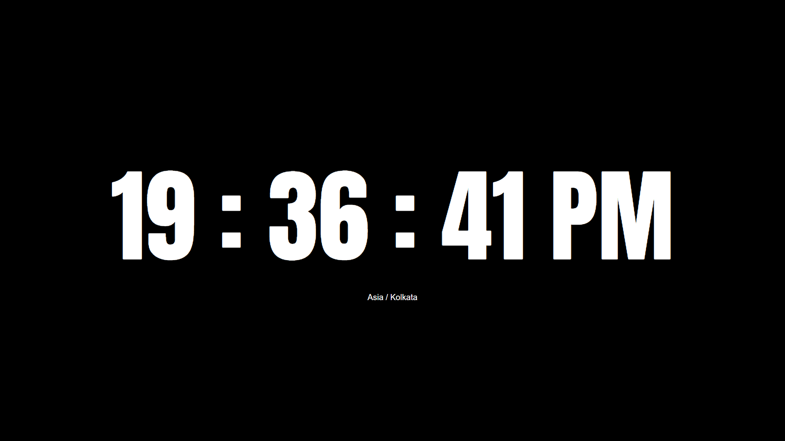

# 🕒 PHP Digital Clock

This is a responsive digital clock web page built using **HTML**, **CSS**, **JavaScript**, and **PHP**. It fetches the server time every second using AJAX and displays it with a modern font and responsive design.

🔗 **Live Demo:**  
👉 [https://digital-clock-by-sonu.infinityfreeapp.com/](https://digital-clock-by-sonu.infinityfreeapp.com/)

---

## 📸 Preview

---

## 🚀 Features

- Real-time server time using PHP (`Asia/Kolkata` timezone)
- Time updates automatically every second via `fetch()`
- Responsive font size based on screen width
- Uses [Anton](https://fonts.google.com/specimen/Anton) from Google Fonts for a modern digital look
- Dark theme with centered layout
- Custom favicon (`clock.png`)

---

## 🛠️ Technologies Used

- ✅ **HTML** – Page structure and content
- ✅ **CSS** – Styling, layout, and responsiveness
- ✅ **JavaScript** – Fetch API for dynamic time updates
- ✅ **PHP** – Server-side clock and timezone handling

---

## 📄 License

This project is free to use for learning and personal projects.  
The [Anton](https://fonts.google.com/specimen/Anton) font is licensed under the [Open Font License (OFL)](https://scripts.sil.org/cms/scripts/page.php?item_id=OFL_web).

---

## 🙌 Credits

- Favicon: `clock.png` (custom)
- Font: [Anton by Vernon Adams](https://fonts.google.com/specimen/Anton)

